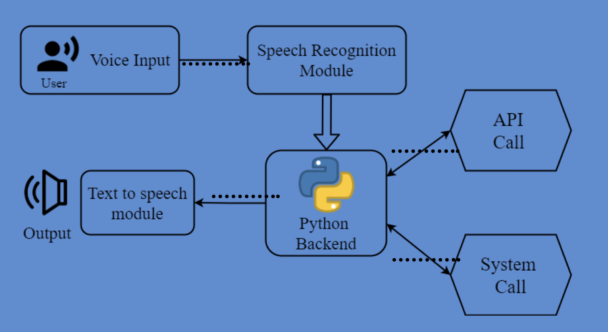
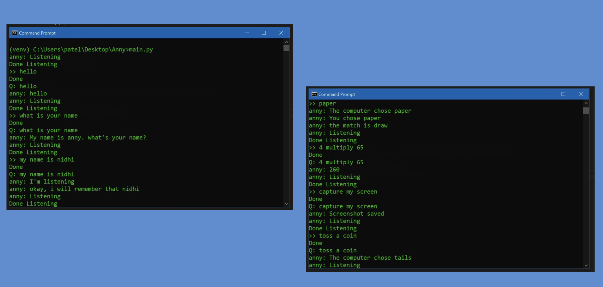
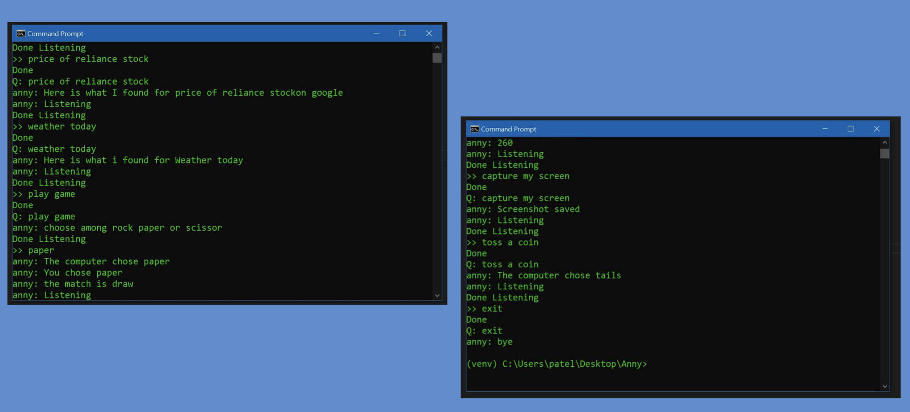

# Desktop Assistant - ANNY

How cool is it to build our own personal assistants like Alexa or Siri?

- It’s not very complicated and can be easily achieved in Python.
- Personal digital assistants are capturing a lot of attention lately.
- Chatbots are common in most commercial websites. With growing advancements in artificial intelligence, training the machines to tackle day-to-day tasks is the norm.
- Voice-based personal assistants have gained a lot of popularity in this era of smart homes and smart devices.
- Desktop assistants can be easily configured to perform many of your regular tasks by simply giving them any voice commands.
- Google has popularized voice-based search that is a boon for many like senior citizens who are not comfortable using the keypad/keyboard.

## Introduction

A voice assistant is a digital assistant that uses voice recognition, language processing algorithms, and voice synthesis to listen to specific voice commands and return relevant information or perform specific functions as requested by the user. Based on specific commands spoken by the user, voice assistants can return relevant information by listening for specific keywords and filtering out the noise.

## Features

- Greetings
- Personalization
- Reads system time
- Performs Google search
- Searches YouTube videos
- Gets stock price
- Shows timetable
- Shows weather  
- Plays a game
- Tosses a coin
- Performs simple operations
- Takes screenshot
- Provides Wikipedia definition
- Gives current location 
- Opens presentation on command

## System Architecture 

## Implementation

<!-- Add more screenshots as necessary -->

## Code

The code for this voice assistant can be found in the [main.py](main.py)

---

For any inquiries or suggestions, please feel free to reach out.
